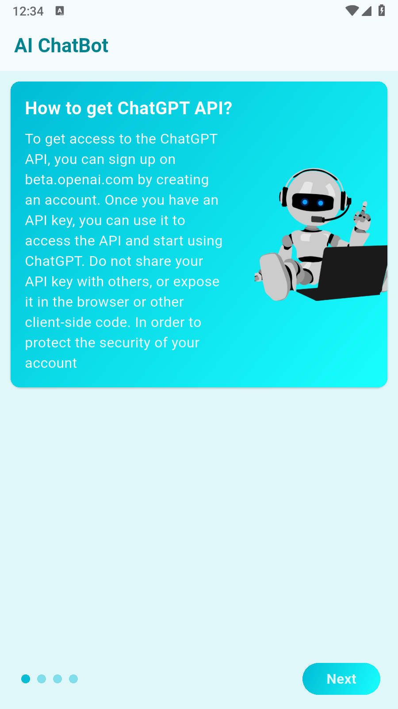
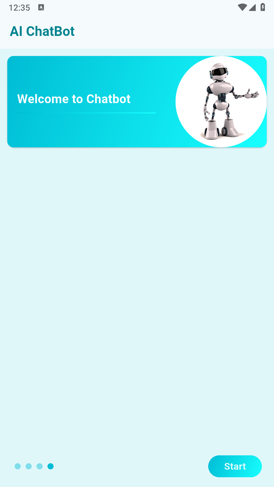

# 🤖 Flutter AI ChatBot

[](https://flutter.dev) 
[](https://dart.dev) 
[](https://android.com) 
[](https://apple.com/ios)
[](https://opensource.org/licenses/MIT)

> An intelligent chat application built with Flutter that leverages Google Gemini AI to provide an advanced and interactive conversational experience

## 📖 Overview

Flutter AI ChatBot is a modern and sophisticated intelligent chat application that utilizes Google Gemini AI technology to deliver a natural and smart conversational experience. The app features an elegant and user-friendly interface with attractive visual effects and smooth animations.

## ✨ Key Features

- 🧠 **Advanced AI Intelligence**: Powered by Google Gemini 2.0 Flash for accurate and fast responses
- 🎨 **Modern Design**: Attractive user interface with gradient colors and distinctive visual effects
- 💬 **Interactive Conversation**: Smooth chat system with conversation history preservation
- 🚀 **High Performance**: Instant response with optimized performance enhancements
- 📱 **Cross-Platform Compatible**: Works on both Android and iOS
- 🎯 **Onboarding Experience**: Interactive introduction screens to guide new users
- 🔒 **Secure & Reliable**: Safe API usage with comprehensive error handling
- 🎨 **Custom UI Components**: Beautiful gradient text and custom border effects
- 📜 **Conversation History**: Complete chat history with timestamp tracking

## 🛠️ System Requirements

| Requirement | Minimum Version |
|-------------|-----------------|
| [Flutter](https://flutter.dev) | ≥ 3.0.0 |
| [Dart](https://dart.dev) | ≥ 3.0.0 |
| Android SDK | ≥ API 21 (Android 5.0) |
| iOS | ≥ 11.0 |
| Xcode | ≥ 12.0 (for iOS development) |

### Required Dependencies
```yaml
dependencies:
  flutter:
    sdk: flutter
  gradient_borders: ^1.0.0
  http: ^0.13.5
```

## 🚀 Installation Steps

### 1. Clone the Repository
```bash
git clone https://github.com/Zeyad-GenAI/Chatbot-AI.git
cd flutter-ai-chatbot
```

### 2. Install Dependencies
```bash
flutter pub get
```

### 3. Setup Google Gemini API
1. Navigate to [Google AI Studio](https://makersuite.google.com/app/apikey)
2. Create a new API key
3. Replace the API key in `chat.dart`:
```dart
final url = "https://generativelanguage.googleapis.com/v1/models/gemini-2.0-flash:generateContent?key=YOUR_API_KEY_HERE";
```

### 4. Add Assets
Ensure the following images are present in the `assets/` folder:
- `robot1.png`
- `robot2.png` 
- `robot_world.png`

Update your `pubspec.yaml`:
```yaml
flutter:
  assets:
    - assets/
```

### 5. Run the Application
```bash
# Run in development mode
flutter run

# Build for production
flutter build apk  # For Android
flutter build ios  # For iOS
```

## 📱 How to Use

### Quick Start Guide
1. **Onboarding Screen**: Browse through the introductory information about the app
2. **Start Chatting**: Tap "Start" to navigate to the chat interface
3. **Send Message**: Type your message in the bottom input field and press the send button
4. **Receive Response**: The AI response will appear instantly in the conversation

### Usage Examples
```
User: "What is the capital of France?"
Bot: "The capital of France is Paris, known for its iconic landmarks..."

User: "Write me a poem about programming"
Bot: "In the world of code we sail and explore..."

User: "Explain machine learning in simple terms"
Bot: "Machine learning is like teaching a computer to learn patterns..."
```

## 📁 Project Structure

```
flutter-ai-chatbot/
├── lib/
│   ├── main.dart              # Main application entry point
│   ├── onboarding.dart        # Onboarding screens and navigation
│   ├── chat.dart              # Main chat interface and AI integration
│   └── gradient_text.dart     # Custom gradient text widget
├── assets/
│   ├── robot1.png             # First robot illustration
│   ├── robot2.png             # Second robot illustration
│   └── robot_world.png        # Robot with world illustration
├── android/                   # Android-specific configuration
├── ios/                       # iOS-specific configuration
├── pubspec.yaml              # Project configuration and dependencies
└── README.md                 # Project documentation
```

### File Descriptions

| File | Description |
|------|-------------|
| `main.dart` | Application entry point with routing and theme configuration |
| `onboarding.dart` | Welcome screens with introduction and user guidance |
| `chat.dart` | Main chat interface with AI integration and message handling |
| `gradient_text.dart` | Custom widget for displaying text with gradient effects |

### Key Components

- **ChatPage**: Main chat interface with message display and input handling
- **OnboardingScreen**: Multi-page introduction with smooth navigation
- **GradientText**: Reusable component for styled text with gradient effects
- **GradientBoxBorder**: Custom border decoration with gradient styling

## 🤝 Contributing to the Project

We welcome contributions to improve this project! Please follow these steps:

### Contribution Guidelines
1. **Fork the Repository** to your personal account
2. **Create a Feature Branch**:
   ```bash
   git checkout -b feature/amazing-feature
   ```
3. **Make Your Changes** ensuring code quality and consistency
4. **Commit Your Changes**:
   ```bash
   git commit -m 'Add some amazing feature'
   ```
5. **Push to Your Branch**:
   ```bash
   git push origin feature/amazing-feature
   ```
6. **Open a Pull Request** with a clear description of changes

### Development Standards
- Follow Dart/Flutter coding conventions and style guide
- Add clear comments for new code functionality
- Test all changes thoroughly before submitting
- Maintain backward compatibility when possible
- Include unit tests for new features
- Update documentation as needed

### Code Review Process
- All contributions require code review before merging
- Ensure CI/CD checks pass successfully
- Address any feedback promptly and professionally
- Maintain clean commit history with meaningful messages

## 📄 License

This project is licensed under the [MIT License](https://opensource.org/licenses/MIT) - see the [LICENSE](LICENSE) file for details.

```
MIT License

Copyright (c) 2024 Flutter AI ChatBot

Permission is hereby granted, free of charge, to any person obtaining a copy
of this software and associated documentation files (the "Software"), to deal
in the Software without restriction, including without limitation the rights
to use, copy, modify, merge, publish, distribute, sublicense, and/or sell
copies of the Software, and to permit persons to whom the Software is
furnished to do so, subject to the following conditions:

The above copyright notice and this permission notice shall be included in all
copies or substantial portions of the Software.

THE SOFTWARE IS PROVIDED "AS IS", WITHOUT WARRANTY OF ANY KIND, EXPRESS OR
IMPLIED, INCLUDING BUT NOT LIMITED TO THE WARRANTIES OF MERCHANTABILITY,
FITNESS FOR A PARTICULAR PURPOSE AND NONINFRINGEMENT.
```

## 🙏 Acknowledgments

### Special Thanks

- **[Google AI](https://ai.google.dev/)** - For providing the Gemini AI API
- **[Flutter Team](https://flutter.dev/community)** - For the amazing Flutter framework
- **[Material Design](https://material.io/)** - For comprehensive design guidelines
- **Flutter Community** - For continuous support and valuable resources
- **Open Source Contributors** - For inspiration and shared knowledge

### Third-Party Libraries
- [http](https://pub.dev/packages/http) - For API communication and HTTP requests
- [Flutter SDK](https://flutter.dev) - Core framework and development tools

### Design Inspiration
- User interface design inspired by modern Material Design principles
- UX/UI concepts from leading chat applications and AI interfaces
- Color schemes and visual effects following contemporary design trends


## 📞 Support & Contact

- **Email**: zeyadelfaramawy@gmail.com
- **GitHub Issues**: [Open Support Ticket](https://github.com/Zeyad-GenAI/flutter-ai-chatbot/issues)
- **Discussions**: [Join Discussions](https://github.com/Zeyad-GenAI/flutter-ai-chatbot/discussions)
- **Documentation**: [Wiki Pages](https://github.com/Zeyad-GenAI/flutter-ai-chatbot/wiki)

### Frequently Asked Questions

**Q: How do I get a Google Gemini API key?**
A: Visit [Google AI Studio](https://makersuite.google.com/app/apikey) and create a new account to get a free API key.

**Q: Can I use this project commercially?**
A: Yes, the project is licensed under MIT License which allows commercial use.

**Q: How do I report a bug?**
A: Please open a new Issue on GitHub with a detailed description of the problem and steps to reproduce.

**Q: Is there a limit to API calls?**
A: Google Gemini has rate limits depending on your plan. Check their documentation for current limits.

**Q: Can I customize the UI theme?**
A: Absolutely! The app uses Material 3 design system. You can modify colors and themes in `main.dart`.

**Q: How do I add new features?**
A: Fork the repository, create a feature branch, implement your changes, and submit a pull request.

---

## 🚀 Roadmap

### Upcoming Features
- [ ] Voice message support
- [ ] Message reactions and emoji support
- [ ] Dark/Light theme toggle
- [ ] Message search functionality
- [ ] Export chat history
- [ ] Multiple AI model support
- [ ] Customizable chat backgrounds
- [ ] Message encryption

### Performance Improvements
- [ ] Message caching system
- [ ] Lazy loading for chat history
- [ ] Image compression optimization
- [ ] Network request optimization

---

## 📱 Screenshots

> Add your app screenshots here to showcase the user interface

| Onboarding | Chat Interface | AI Response |
|------------|----------------|-------------|
|  |  |  |

---

<div align="center">

### 🌟 Show Your Support

Give a ⭐️ if this project helped you!

[](https://buymeacoffee.com/Zeyad)

</div>
<div align="center">

**Made with ❤️ and Flutter**

[⭐ If you like this project, don't forget to give it a star](https://github.com/Zeyad-GenAI/Chatbot-AI)

</div>
